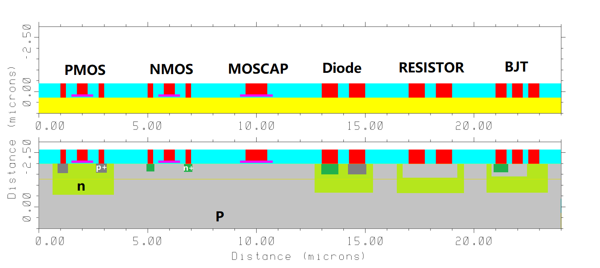
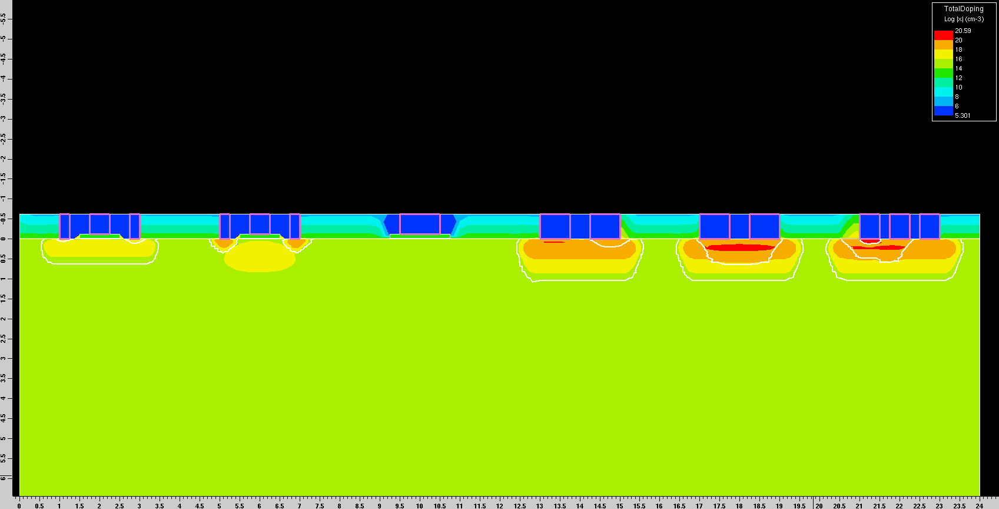

# TSUPREM fabrication simulation
Initial Substrate: 1E15 Boron Doped P-Substrate

## Content
Device made:
- PMOS
- NMOS
- MOSCAP
- DIODE
- RESISTOR
- BJT

Both MOS has a threshold voltage of 1.000V
